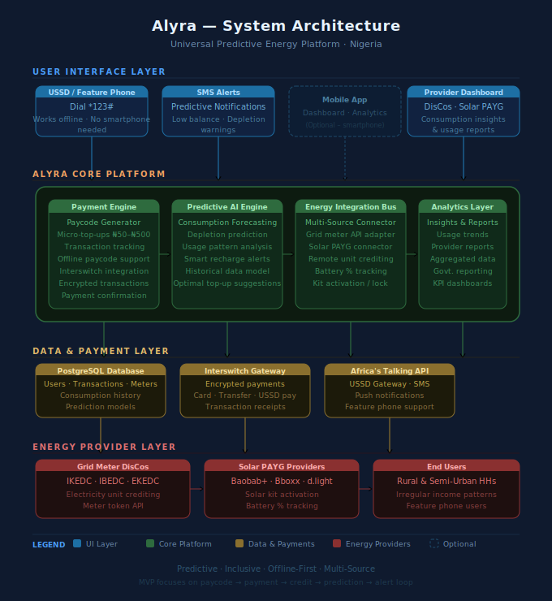

# Alyra

> *Alyra is a smart energy platform that provides flexible, inclusive, and predictive electricity access for rural and semi-urban households in Nigeria. It unifies prepaid grid meters and PAYG solar home systems under one seamless interface, enabling users to purchase energy, receive predictive consumption alerts, and make incremental payments regardless of internet connectivity or phone type.
Alyra empowers households to access electricity without unexpected outages, align energy spending with irregular incomes, and optimize usage for long-term sustainability.*



## Table of Contents

- [Overview](#overview)
- [Problem Statement](#problem-statement)
- [Target Users](#target-users)
- [Value Proposition](#value-proposition)
- [Core Features](#core-features)
- [How It Works](#how-it-works)
- [System Architecture](#system-architecture)
- [UI / Wireframes](#ui--wireframes)
- [MVP Scope](#mvp-scope)
- [Go-To-Market Strategy](#go-to-market-strategy)
- [Key Metrics](#key-metrics)
- [Roadmap](#roadmap)
- [Why Alyra](#why-alyra)

## Overview

**Alyra** is a smart energy platform that provides flexible, inclusive, and predictive electricity access for rural and semi-urban households in Nigeria. It unifies prepaid grid meters and Pay-As-You-Go (PAYG) solar home systems under one seamless interface.

Users can purchase energy, receive predictive consumption alerts, and make incremental payments regardless of internet connectivity or phone type. Alyra empowers households to:

- Access electricity without unexpected outages
- Align energy spending with irregular incomes
- Optimise usage for long-term sustainability

## Problem Statement

Nigeria's energy landscape presents three critical gaps:

| #   | Problem                                                                                                                                                                      | Impact                               |
| --- | ---------------------------------------------------------------------------------------------------------------------------------------------------------------------------- | ------------------------------------ |
| 1   | **Grid prepaid meter users** experience unpredictable blackouts due to irregular top-ups or mismanaged units. Fixed recharge amounts don't match irregular incomes.          | Unplanned outages, lost productivity |
| 2   | **Solar home system users** have no top-up mechanism and no predictive guidance on battery usage, leading to unexpected power shortages.                                     | Avoidable power loss, frustration    |
| 3   | **Existing solutions are fragmented.** Some vend electricity, others provide PAYG solar, but none combine predictive intelligence, flexible payments, and offline usability. | No single reliable solution exists   |

**Opportunity:** A platform combining predictive analytics, flexible top-ups, and a unified interface across energy types can reduce outages, improve affordability, and make energy access dependable.

## Target Users

- Rural and semi-urban households with prepaid meters or solar home systems
- Households with irregular or daily income patterns
- Users with feature phones or limited internet access
- Early adopters seeking predictive alerts, flexibility, and transparency in energy spending

## Value Proposition

### For Users (Rural / Semi-Urban Households)

> _"With Alyra, you know exactly when your electricity will run out and how much it will cost to keep the lights on. You can top up in small amounts that match your income, all from your feature phone, even without internet. No surprises, no blackout shocks."_

| Differentiator    | Description                                     |
| ----------------- | ----------------------------------------------- |
| Predictive alerts | Prevent unexpected outages before they happen   |
| Micro-payments    | Pay only what you can afford, when you can      |
| Offline-first     | Works on feature phones and without internet    |
| Unified interface | Covers both grid and solar systems in one place |

### For Providers (DisCos and Solar PAYG Companies)

> _"Alyra lets you increase revenue per user while reducing defaults and operational inefficiencies. Our predictive analytics show consumption patterns, allowing you to plan energy delivery more effectively and give your customers a reliable, transparent experience."_

| Differentiator       | Description                                             |
| -------------------- | ------------------------------------------------------- |
| Consumption insights | Aggregated, actionable usage data                       |
| Fewer defaults       | Reduced unit wastage and failed payments                |
| Integration-ready    | Compatible with both grid meters and PAYG solar systems |
| Retention            | Strengthens user trust and loyalty                      |

## Core Features

### 1. Paycode / Micro-Payment System

- Users generate a paycode to purchase energy units (grid) or unlock solar kit usage
- Works **offline** and on **feature phones**
- Supports micro-top-ups aligned with irregular incomes (N50 to N500 increments)

### 2. Integration with Energy Sources

- **Grid meters:** Credits electricity units remotely via APIs or simulated meters in MVP
- **Solar PAYG systems:** Tracks battery % and enables access based on incremental payments

### 3. Predictive Energy Monitoring

- Tracks consumption patterns of both meters and batteries
- Predicts depletion and sends alerts **before** outages occur
- Suggests optimal recharge amounts based on historical usage and daily habits

### 4. Flexible Recharge and Alerts

- Incremental top-ups prevent overpayment
- SMS / USSD notifications guide users on **when** and **how much** to recharge

### 5. Secure Payment Processing

- Interswitch API integration ensures transactions are encrypted, traceable, and reliable
- Payment confirmation triggers automatic energy credit or system activation

### 6. Analytics and Insights Dashboard

- Tracks household energy usage trends
- Provides predictive reports for both providers and end-users
- Optional aggregation for provider planning and governmental reporting

## How It Works

### Scenario 1: Grid Prepaid Meter

```
User dials USSD
      |
Selects "Buy Electricity"
      |
Alyra generates Paycode
      |
User pays via Interswitch
      |
Paycode sent to meter, units credited
      |
Alyra monitors usage, predicts depletion
      |
Alert sent, user tops up incrementally
```

### Scenario 2: Solar PAYG System

```
User dials USSD or sends micro-payment
      |
Alyra verifies payment, activates solar kit remotely
      |
Alyra tracks battery % and energy consumption
      |
Predicts depletion, alert sent before energy runs out
      |
User pays next micro-installment, system remains active
```

## System Architecture

```
                        +-----------------------+
                        |        ALYRA          |
                        |  Payment & AI Layer   |
                        |  +------------------+ |
                        |  | Predictive Engine| |
                        |  | Payment Gateway  | |
                        |  | USSD / SMS Layer | |
                        |  +------------------+ |
                        +-----------+-----------+
                                    |
                   +----------------+----------------+
                   |                                 |
         +---------+---------+             +---------+---------+
         |   Grid Meters     |             |   Solar PAYG      |
         |  (IKEDC, IBEDC)   |             |  (Baobab+, Bboxx) |
         +---------+---------+             +---------+---------+
                   |                                 |
         Users purchase units             Users pay installments
                   |                                 |
                   +----------------+----------------+
                                    |
                   +----------------v----------------+
                   |  Alyra predicts depletion,      |
                   |  sends alerts, recommends       |
                   |  top-ups                        |
                   +---------------------------------+
```

**Tech Stack (MVP):**

| Layer                | Technology                      |
| -------------------- | ------------------------------- |
| USSD / SMS Interface | Africa's Talking / USSD Gateway |
| Payment Processing   | Interswitch API                 |
| Predictive Engine    | ML-based consumption model      |
| Backend              | Rust                            |
| Frontend             | Next.js                         |
| Database             | PostgreSQL                      |
| Meter Simulation     | Internal mock API (MVP)         |

## UI / Wireframes

| Screen                          | Description                        | Key Elements                                                 |
| ------------------------------- | ---------------------------------- | ------------------------------------------------------------ |
| **Home (USSD / Feature Phone)** | Simple menu for top-up or balance  | Menu: "1. Buy Energy, 2. Check Balance, 3. Alerts"           |
| **Top-Up Amount Selection**     | Choose units or payment amount     | Numeric keypad, confirm button                               |
| **Payment Confirmation**        | Shows paycode and payment status   | Paycode display, payment instructions, success tick          |
| **Meter / Battery Status**      | Shows current units or battery %   | Battery/meter icon, units remaining, time-to-depletion       |
| **Alerts / Recommendations**    | Predictive recharge notifications  | SMS/USSD alert text, suggested recharge, "Pay Now" option    |
| **Analytics Dashboard**         | Consumption trends (provider view) | Line charts, daily/weekly usage, recommended top-up schedule |

## MVP Scope

The MVP focuses on validating the core loop: **paycode to payment to credit to prediction to alert**.

In scope:

- Simulate both grid meters and solar battery units
- Full paycode to payment to credit to prediction to alert flow
- Offline / feature-phone usability
- Predictive analytics and micro-payments

Out of scope:

- Physical electricity delivery
- Live DisCo API integration (simulated in MVP)

## Go-To-Market Strategy

### Target Segments

| Priority  | Segment                                                 |
| --------- | ------------------------------------------------------- |
| Primary   | Rural households with PAYG solar systems                |
| Secondary | Semi-urban households with prepaid grid meters          |
| Tertiary  | Microfinance agents, cooperatives, local energy vendors |

### Acquisition Channels

1. **Partnerships** with solar PAYG providers (Baobab+, Bboxx) and DisCos (IKEDC, IBEDC)
2. **Local agents and community champions** to educate users and assist with top-ups
3. **SMS / USSD marketing** for offline awareness campaigns
4. **NGO collaborations** and rural electrification programs

### Pricing Model

| Revenue Stream         | Details                                         |
| ---------------------- | ----------------------------------------------- |
| Transaction fee        | Small % per paycode generated                   |
| Micro-top-ups          | N50 to N500 increments                          |
| Analytics subscription | Optional; for advanced insights (provider tier) |

### Launch Phases

```
Phase 1: Pilot
  50 to 100 households
  Focus: usability and predictive alerts

Phase 2: Scale
  Partner with solar PAYG providers and DisCos
  Expand to multiple states

Phase 3: Expansion
  Analytics dashboard for providers
  Optional IoT controllers for solar-only systems
```

## Key Metrics

| Metric                   | What It Measures                             |
| ------------------------ | -------------------------------------------- |
| Outage avoidance rate    | % of users avoiding unexpected outages       |
| Top-up frequency         | Number of incremental top-ups per household  |
| Transaction success rate | Completion rate via Interswitch              |
| Alert engagement         | User response rate to predictive alerts      |
| Provider partnerships    | Number of DisCo / solar PAYG integrations    |
| Prediction accuracy      | % of outages correctly predicted and avoided |

## Roadmap

| Phase       | Milestone                                                        |
| ----------- | ---------------------------------------------------------------- |
| **Now**     | MVP: Simulated meters, paycode flow, predictive alerts           |
| **Q2**      | Integrate with real DisCos for live meter top-ups                |
| **Q3**      | Partner with PAYG solar providers for seamless activation        |
| **Q4**      | Household-level energy optimisation recommendations              |
| **Year 2**  | Expand to neighbouring countries (Ghana, Cote d'Ivoire, Senegal) |
| **Year 2+** | IoT-enabled smart controllers for battery-only solar systems     |

## Why Alyra

Alyra is the **first Nigerian energy platform** to:

| Capability                  | Details                                             |
| --------------------------- | --------------------------------------------------- |
| **Unified energy access**   | Seamlessly combines grid and solar in one interface |
| **Predictive intelligence** | Predicts energy depletion and prevents blackouts    |
| **Income-aligned payments** | Flexible micro-top-ups matching irregular incomes   |
| **Offline-first**           | Works on feature phones, no internet required       |
| **Dual-sided insights**     | Actionable data for both users and energy providers |

> **In short: Alyra is a universal, predictive, and inclusive energy platform that empowers households to reliably access electricity anytime, anywhere.**

## TEAMS

## Product Management

Abdullahi Nofisat - Product Manager
. Defined product vision and positioning for Alyra
. Wrote the PRD (features, MVP scope, GTM strategy)
. Designed user flows (paycode system, alerts, recharge logic)
. Led overall product direction and experience


## Engineering

Oyetunde D. - Software Engineer
. Built core system architecture
. Implemented paycode generation and validation
. Integrated payment processing 
. Developed energy vending and predictive monitoring logic
